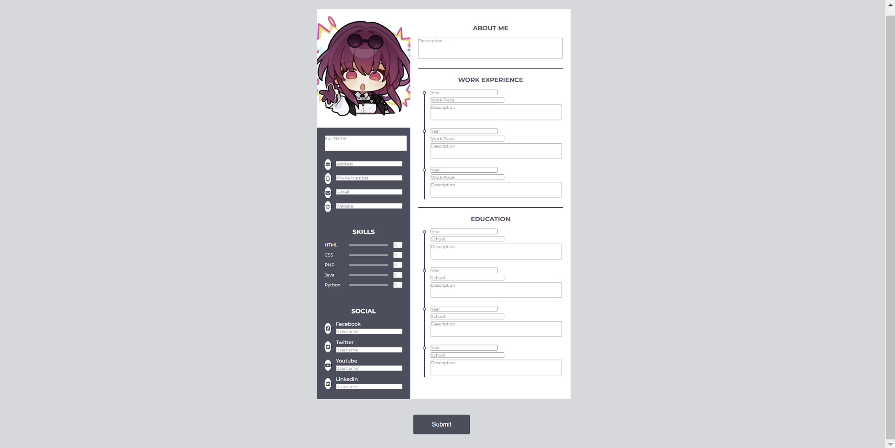
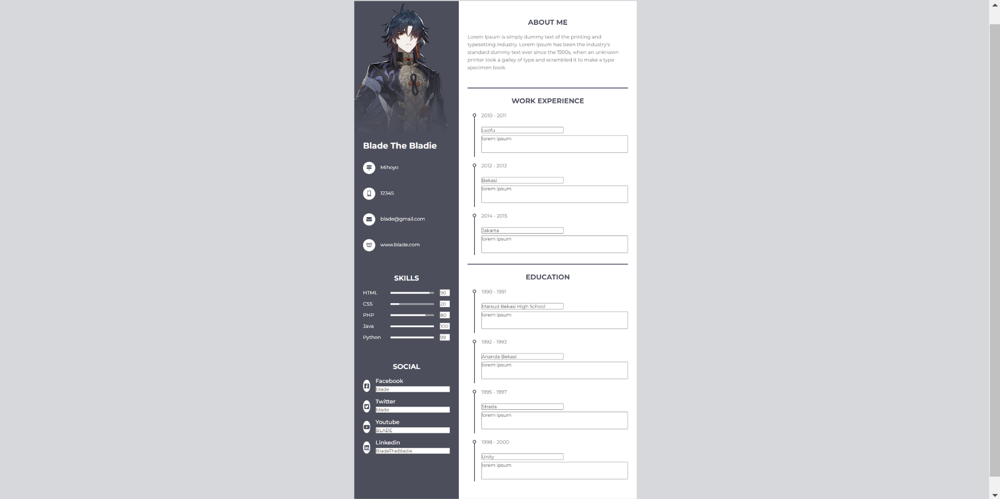

<h1 align="center">Curriculum Vitae</h1>

  <em> A Curriculum Vitae (CV) is a professional document that outlines a person's background, education, skills, work experience, and achievements. It is commonly used when applying for jobs, internships, or academic opportunities, especially in more formal or international contexts. A well-crafted CV presents essential information in a clear and organized way, allowing employers or institutions to evaluate a candidate quickly and effectively.

In this website project, I designed a sample CV layout using a modern and minimalist approach. For the visual profile, I used an image of Blade, a character from Honkai: Star Rail, to serve as a placeholder photo. The use of Blade reflects a stylistic and creative touch while demonstrating how a CV might look with a professional portrait. The structure includes personal details, education background, skill sections, and contact information — all arranged in a clean, web-based format.
</em>

## 🌐 Live Preview
Visit Website (https://github.com/lyneyy/cv-coding.git)

## 🖼️ Preview

This is a visual preview of the web-based CV project.

